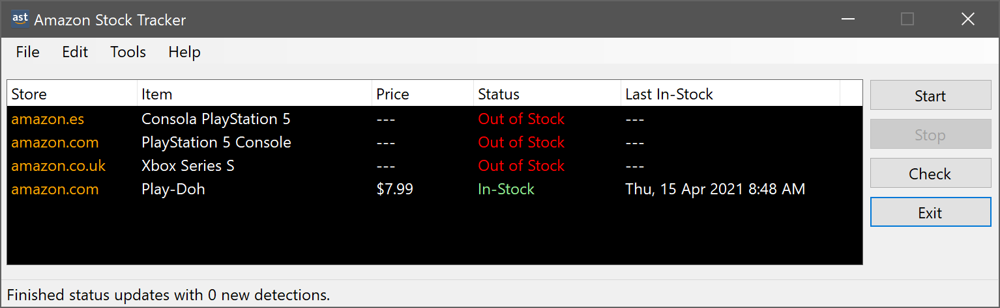

# Amazon Stock Tracker

[](https://github.com/StevenJDH/Amazon-Stock-Tracker/actions/workflows/dotnet-sonar-workflow.yml)


[](https://www.codacy.com/gh/StevenJDH/Amazon-Stock-Tracker/dashboard?utm_source=github.com&amp;utm_medium=referral&amp;utm_content=StevenJDH/Amazon-Stock-Tracker&amp;utm_campaign=Badge_Grade)
[](https://sonarcloud.io/dashboard?id=StevenJDH_Amazon-Stock-Tracker)
[](https://sonarcloud.io/dashboard?id=StevenJDH_Amazon-Stock-Tracker)
[](https://sonarcloud.io/dashboard?id=StevenJDH_Amazon-Stock-Tracker)
[](https://sonarcloud.io/dashboard?id=StevenJDH_Amazon-Stock-Tracker)
[](https://sonarcloud.io/dashboard?id=StevenJDH_Amazon-Stock-Tracker)
[](https://sonarcloud.io/dashboard?id=StevenJDH_Amazon-Stock-Tracker)
[](https://sonarcloud.io/dashboard?id=StevenJDH_Amazon-Stock-Tracker)
[](https://sonarcloud.io/dashboard?id=StevenJDH_Amazon-Stock-Tracker)


Amazon Stock Tracker is a tool to monitor the in-stock status of products on Amazon for any country and notifies you with Voice, SMS, and Email alerts once new stock is detected. My motivation to create this was that I needed a tool that supported more than just the usual 5 to 7 countries. Also, I wanted something more than just Emails, RSS feeds, and Telegram bots as the primary means for notifications. As such, Amazon Stock Tracker provides the notification options mentioned earlier plus extensibility for future additions. There is still lots to do, but it's working despite this being very much an early alpha. Feel free to contribute if you're interested, since I'm not sure how much free time I will have to complete this quickly. 



[](https://www.buymeacoffee.com/stevenjdh)

Releases: [https://github.com/StevenJDH/Amazon-Stock-Tracker/releases](https://github.com/StevenJDH/Amazon-Stock-Tracker/releases)

## Features
* Support for tracking multiple items across Amazon's 19+ store regions.
* Voice notifications using local speech synthesis (TTS) in language of choice.
* Neural Voice notifications using Azure Cognitive Speech Services in language of choice.
* SMS and Email Notifications using Amazon Web Services (AWS).
* Custom notifications using product name, stock status, and price.
* Last seen in stock tracking.
* Double-clicking an item in the list opens its product page.

## Prerequisites
* .NET 5 or newer installed.
* Installed language packs for local voices.
* An AWS account for related notification services.
* An Azure account for related notification services.

## Basic setup
First, run the application once so that it generates your initial configuration. Then, close the application, and add the list of products you want to track to the `AmazonStockTrackerProducts.json` file in the `%appdata%\ASC-C\Amazon Stock Tracker` folder using the below as an example. The `asin` value can be found in the product URL just after the `/dp/` segment, for example, `https://www.amazon.com/PlayStation-5-Console/dp/B08FC5L3RG/`.

```json
[
  { "name": "Consola PlayStation 5", "asin": "B08KKJ37F7", "store": "amazon.es" },
  { "name": "PlayStation 5 Console", "asin": "B08FC5L3RG", "store": "amazon.com" },
  { "name": "Xbox Series S", "asin": "B087VM5XC6", "store": "amazon.co.uk" }
]
```

Next, review the configuration in the `AmazonStockTrackerConfig.json` located in the same folder to see if any defaults need to be changed. By default, stock checks happen every 2 minutes with only local voice notifications enabled. If SMS and or Email notifications are required, or even better Voice options, then see the next section for what the different properties mean so that they can be edited accordingly. Finally, run the Amazon Stock Tracker to load the listed products, and happy tracking!

## Additional configuration
For now, Amazon Stock Tracker requires manual configuration for most settings, so the following will explain what each property means and what is needed to enable additional notification services like SMS, Email, and realistic Neural Voices that are very cheap to use if not free in some cases.

```json
{
  "checkIntervalSeconds": 120,
  "notificationMessage": "The {PRODUCT} is in stock for {PRICE}",
  "localVoiceName": "default",
  "awsProfile": "default",
  "awsRegion": "eu-west-3",
  "awsSmsEnabled": false,
  "awsSmsNumber": "+1XXX5550100",
  "awsSmsSenderId": "default",
  "awsSmsType": "Promotional",
  "awsSmsMaxPrice": "0.50",
  "awsSmsMonthlySpendLimit": "1",
  "awsEmailEnabled": false,
  "awsEmailAddress": "success@simulator.amazonses.com",
  "azureVoiceEnabled": false,
  "azureVoiceName" : "default",
  "azureVoiceKey": "xxxxxx",
  "azureVoiceRegion": "westeurope"
}
```

### checkIntervalSeconds
The amount of time in seconds to run a stock check. This value should always be larger than the total time needed to check each product in the list.

### notificationMessage
The customizable notification message that is used for Voice, SMS, and Email notifications. Optionally, use `{PRODUCT}`, `{PRICE}`, and `{STORE}` placeholders to include product data in the notification.

### localVoiceName
The name of the Voice to use for notifications using local speech synthesis (TTS). Setting this to `default` will automatically default to the system default. Third-party voices are also supported (ideally Sapi5 compatible), which will provide higher quality voices. For example, [Ivona Voices](https://nextup.com/ivona/). To see what Voices are currently installed and their associated language code, run the following commands with PowerShell:

```powershell
Add-Type -AssemblyName System.speech 
$synthesizer = New-Object System.Speech.Synthesis.SpeechSynthesizer
$synthesizer.GetInstalledVoices().VoiceInfo | Select-Object -Property Culture, Name, Gender | Sort-Object Culture, Name
```
Make sure that the selected voice's culture language code matches the language used in the `notificationMessage` property for proper pronunciation, since this will not result in an accent like when using the Azure Cognitive Speech Services feature below. See [Language packs for Windows](https://support.microsoft.com/en-us/windows/language-packs-for-windows-a5094319-a92d-18de-5b53-1cfc697cfca8) for more information.

### awsProfile
A profile name containing the access and secret keys along with the correct IAM permissions needed to access the SNS and SES services in AWS. This can be ignored if the `awsSmsEnabled` and `awsEmailEnabled` properties are set to `false`. It's recommended to set this from the `File > Add AWS Account` menu in the application to avoid duplicate profile names since AWS stores this type of information in multiple locations in Windows with an order of precedence. Also, unlike setting this up with `aws configure` using the AWS CLI or doing it manually as per [Configuration and credential file settings](https://docs.aws.amazon.com/cli/latest/userguide/cli-configure-files.html), which stores this sensitive information in clear text in the `credentials` file in the `%homepath%\.aws` folder, Amazon Stock Tracker saves the credentials to the AWS SDK Store in encrypted form located here `%LOCALAPPDATA%\AWSToolkit\RegisteredAccounts.json`. Regardless of the method used to configure access, make sure to use an MFA protected IAM user with programmatic access and not a Root user. See [Creating an IAM user in your AWS account](https://docs.aws.amazon.com/IAM/latest/UserGuide/id_users_create.html), [Managing access keys (console)](https://docs.aws.amazon.com/IAM/latest/UserGuide/id_credentials_access-keys.html#Using_CreateAccessKey), and [Configuring AWS Credentials](https://docs.aws.amazon.com/sdk-for-net/v3/developer-guide/net-dg-config-creds.html) for more information.

### awsRegion
An AWS regional endpoint from which to call AWS services from. This can be set from within the application when configuring the `awsProfile` property as per the above recommendation. See [Regions and Zones](https://docs.aws.amazon.com/AWSEC2/latest/UserGuide/using-regions-availability-zones.html) for the supported list.

### awsSmsEnabled
Enables and disables SMS notifications via AWS SNS. If enabled, make sure to set the `awsSmsNumber` property. See [Supported Regions and countries](https://docs.aws.amazon.com/sns/latest/dg/sns-supported-regions-countries.html) for more information.

### awsSmsNumber
The phone number that will receive the SMS notification. Make sure to include the + symbol and the country code. See [Worldwide SMS Pricing](https://aws.amazon.com/sns/sms-pricing/) and [Publishing to a mobile phone](https://docs.aws.amazon.com/sns/latest/dg/sms_publish-to-phone.html) for more information regarding pricing and size quotas.

### awsSmsSenderId
A custom ID that contains 3-11 alphanumeric characters, including at least one letter and no spaces. The sender ID is displayed as the message sender on the receiving device. For example, you can use your name to make the message source easier to recognize. Support for sender IDs varies by country and/or region. For example, messages delivered to U.S. phone numbers will not display the sender ID. If you do not specify a sender ID, the message will display a long code as the sender ID in supported countries and regions. For countries or regions that require an alphabetic sender ID, the message displays `NOTICE` as the sender ID. This will be set at the message level to avoid making persistent changes at the account level.

### awsSmsType
Defines the type of messages being sent. Set to `Promotional` for noncritical messages, such as marketing messages, amazon stock tracking notifications, etc. Amazon SNS optimizes the message delivery to incur the lowest cost. Set to `Transactional` for critical messages, which AWS describes as those messages that support customer transactions, such as one-time passcodes for multi-factor authentication. Amazon SNS optimizes the message delivery to achieve the highest reliability. The `Promotional` option is the recommended one for this application, and this will be set at the message level to avoid making persistent changes at the account level. See [Service quotas](https://docs.aws.amazon.com/general/latest/gr/sns.html#limits_sns) for the different quotas associated with these options. 

### awsSmsMaxPrice
The maximum amount in USD that you are willing to spend to send the SMS message, which is like a form of protection in case prices ever change. Amazon SNS will not send the message if it determines that doing so would incur a cost that exceeds the maximum price. This attribute has no effect if your month-to-date SMS costs have already exceeded the quota set in the `awsSmsMonthlySpendLimit` property.

### awsSmsMonthlySpendLimit
The maximum amount in USD that you are willing to spend each month to send SMS messages. When Amazon SNS determines that sending an SMS message would incur a cost that exceeds this limit, it stops sending SMS messages within minutes. This value will be set at the account level, and only if there is no explicitly defined value already set in the AWS account. The default limit in your AWS account is `1`, and if you set it to a higher value, it will cause an error as it exceeds this hard limit. If you need a higher limit, see [How do I request a spending limit increase for SMS messages in Amazon SNS?](https://aws.amazon.com/premiumsupport/knowledge-center/sns-sms-spending-limit-increase/).

### awsEmailEnabled
Enables and disables Email notifications via AWS SES. If enabled, make sure to set the `awsEmailAddress` property. See [Service Endpoints](https://docs.aws.amazon.com/general/latest/gr/ses.html#ses_region) for more information about supported regions and countries.

### awsEmailAddress
The email address that will receive the Email notification. The SES API interface is being used with the AWS Profile defined in the `awsProfile` property using the latest SDK (AWSSDK.SimpleEmailV2) at the time of this writing, so there is no need for separate SMTP credentials and configuration. By default, your AWS account is in Sandbox mode, so [email addresses must be verified](https://docs.aws.amazon.com/ses/latest/DeveloperGuide/verify-email-addresses-procedure.html#verify-email-addresses-procedure-console) before they can be used. However, the quotas in Sandbox mode should be more than enough, see [Moving out of the Amazon SES sandbox](https://docs.aws.amazon.com/ses/latest/DeveloperGuide/request-production-access.html). Amazon Stock Tracker only requires you to verify 1 email address via the AWS console in Sandbox mode, since it will use this address as both the sender and the receiver. The default email address being used as a placeholder is actually one of addresses from the [SES mailbox simulator](https://docs.aws.amazon.com/ses/latest/DeveloperGuide/send-email-simulator.html), so if used for testing, remember that regular pricing rates still apply. [Amazon SES pricing](https://aws.amazon.com/ses/pricing/), [Types of Amazon SES credentials](https://docs.aws.amazon.com/ses/latest/DeveloperGuide/send-email-concepts-credentials.html), and [Service quotas](https://docs.aws.amazon.com/general/latest/gr/ses.html#limits_ses_quota), and for more information.

### azureVoiceEnabled
Enables and disables Neural Voice notifications via Azure Cognitive Speech Services for human realistic voices that can even mimic accents. If enabled, make sure to set all the `azureVoice***` properties below. Enabling this feature will also disable the local voice feature defined by the `localVoiceName` property. See [Text to Speech](https://azure.microsoft.com/en-us/services/cognitive-services/text-to-speech/#features), and scroll down to about the middle of the page, to test how the difference voices sound like.

### azureVoiceName
The name of the Voice to use for notifications. Setting this to `default` will automatically default to whatever voice is set by Azure Cognitive Speech Services. See [Language and voice support for the Speech service](https://docs.microsoft.com/en-us/azure/cognitive-services/speech-service/language-support#text-to-speech) for a list of supported neural voices that are powered by deep neural networks, and [Cognitive Services pricing—Speech Services](https://azure.microsoft.com/en-us/pricing/details/cognitive-services/speech-services/) for pricing, although with Free Tier (F0), you get more than enough for this application.

### azureVoiceKey
The key generated by the Cognitive Services instance that must be created as per [Create the Azure resource](https://docs.microsoft.com/en-us/azure/cognitive-services/speech-service/overview#try-the-speech-service-for-free) to access this service. Just remember to select the free (F0) pricing tier when creating the instance unless you want to pay.

### azureVoiceRegion
The region where the Cognitive Services instance was created (without spaces), which you can find under the `Keys and Endpoint` section where the key from the `azureVoiceKey` property was generated. To get the best performance, select a region that’s closest to you or where your application runs. The Speech service availabilities vary from different regions. Make sure that you create your resource in a supported region. See [Speech service supported regions](https://docs.microsoft.com/en-us/azure/cognitive-services/speech-service/regions#speech-to-text-text-to-speech-and-translation) for more information.

## NSIS installer project
I've included the NSIS (Nullsoft Scriptable Install System) script that I wrote to create the installer for Amazon Stock Tracker. The script was written with NSIS 3.04, which you can find here [http://nsis.sourceforge.net/Main_Page](http://nsis.sourceforge.net/Main_Page), and it may not work with earlier versions due to missing features in the scripting language. The Amazon Stock Tracker installer supports installing the program for all users, the current user, or for both at the same time. Silent installs and uninstalls can also be performed, and a restriction of at least Windows 7 is imposed to meet requirements for the .Net Framework version used. You'll also need the SelfDel plug-in found here [https://nsis.sourceforge.io/SelfDel_plug-in](https://nsis.sourceforge.io/SelfDel_plug-in) to compile the script. This plugin will enable the installer to delete itself from the `%Temp%` folder when updating directly from Amazon Stock Tracker once this feature is implemented.

## Disclaimer
Amazon Stock Tracker is distributed in the hope that it will be useful, but WITHOUT ANY WARRANTY; without even the implied warranty of MERCHANTABILITY or FITNESS FOR A PARTICULAR PURPOSE. See the GNU General Public License for more details.

## Do you have any questions?
Many commonly asked questions are answered in the FAQ:
[https://github.com/StevenJDH/Amazon-Stock-Tracker/wiki/FAQ](https://github.com/StevenJDH/Amazon-Stock-Tracker/wiki/FAQ)

## Want to show your support?

|Method       | Address                                                                                                    |
|------------:|:-----------------------------------------------------------------------------------------------------------|
|PayPal:      | [https://www.paypal.me/stevenjdh](https://www.paypal.me/stevenjdh "Steven's Paypal Page")                  |
|Bitcoin:     | 3GyeQvN6imXEHVcdwrZwKHLZNGdnXeDfw2                                                                         |
|Litecoin:    | MAJtR4ccdyUQtiiBpg9PwF2AZ6Xbk5ioLm                                                                         |
|Ethereum:    | 0xa62b53c1d49f9C481e20E5675fbffDab2Fcda82E                                                                 |
|Dash:        | Xw5bDL93fFNHe9FAGHV4hjoGfDpfwsqAAj                                                                         |
|Zcash:       | t1a2Kr3jFv8WksgPBcMZFwiYM8Hn5QCMAs5                                                                        |
|PIVX:        | DQq2qeny1TveZDcZFWwQVGdKchFGtzeieU                                                                         |
|Ripple:      | rLHzPsX6oXkzU2qL12kHCH8G8cnZv1rBJh<br />Destination Tag: 2357564055                                        |
|Monero:      | 4GdoN7NCTi8a5gZug7PrwZNKjvHFmKeV11L6pNJPgj5QNEHsN6eeX3D<br />&#8618;aAQFwZ1ufD4LYCZKArktt113W7QjWvQ7CWDXrwM8yCGgEdhV3Wt|


// Steven Jenkins De Haro ("StevenJDH" on GitHub)
